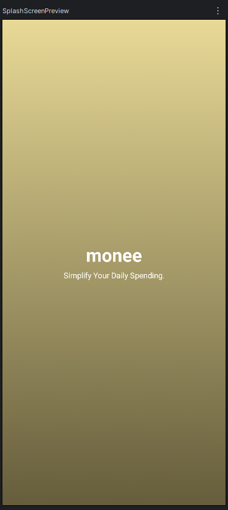
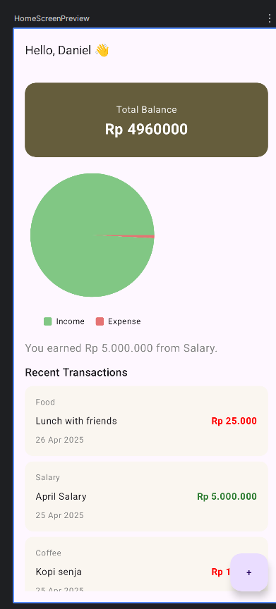
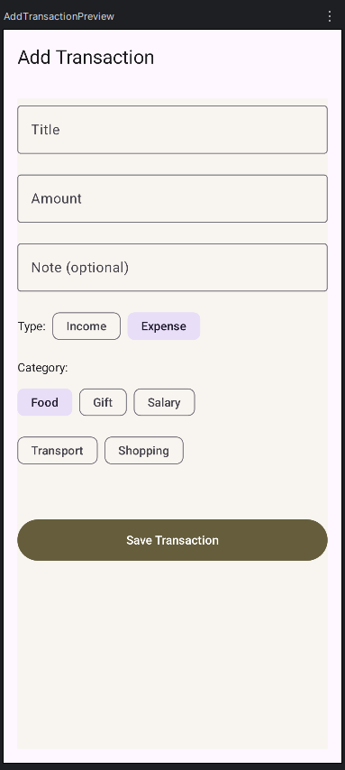
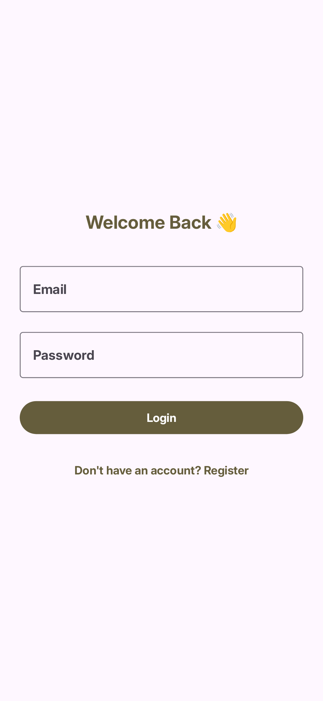

# Monee

Monee is a simple personal finance tracking app built with Jetpack Compose.

This project is created as part of the MidTerm Test for Mobile Programming course.

## Features

- Add new income or expense transactions
- View recent transactions
- Visualize financial summary with a pie chart.

## Screen Preview

| Splash Screen | Home Screen | Add Transaction |
|:-------------:|:-----------:|:----------------:|
|  |  |  |

| Register Screen | Login Screen |
|:---------------:|:------------:|
|  |  |
